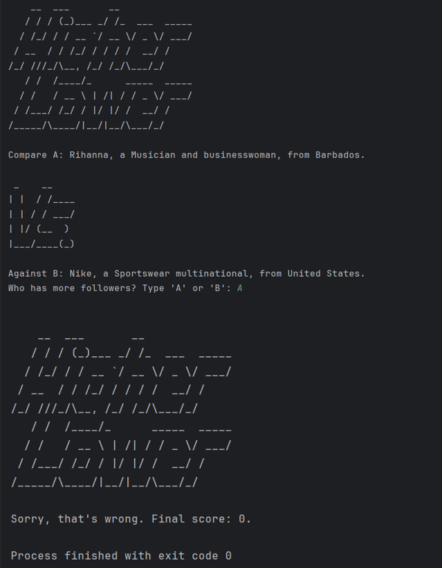

# 🚀 Higher Lower Game

Welcome to the **Higher Lower Game**\! This is a simple and fun command-line game where you guess which of two personalities or brands has more followers on Instagram. Test your social media knowledge and see how high you can score\!

This project is built with Python and demonstrates clean, modular code.

-----

## Output 📸

Here's what the game looks like in action:


-----

## ✨ Features

  * **Score Tracking:** The game keeps track of your current score as you play.
  * **Simple Interface:** Easy to play directly in your terminal.

-----

## 🎮 How to Play

To get the game running on your local machine, follow these simple steps.

### Installation & Execution

1.  **Clone the repository:** Open your terminal and run the following git command.

    ```bash
    git clone https://github.com/Ebenezer-B/higher-follower-count-game.git
    ```

2.  **Navigate to the project directory:**

    ```bash
    cd higher-follower-count-game
    ```

3.  **Run the game:** Execute the main script using Python.

    ```python
    python main.py
    ```

4.  When prompted, type **'A'** or **'B'** to guess which account has more followers and press Enter. Try to get the longest winning streak\!

> **Note:** The game will clear the screen after each round to keep the display clean.

-----

## 📂 Project Structure

The repository is organized into clear, modular files for better readability and maintenance.

  * `main.py`: This is the main script that contains the primary game logic.
  * `art.py`: This file holds the ASCII art for the `logo` and `vs` separator.
  * `game_data.py`: Contains the list of accounts and their data.
  * `output.png`: A screenshot demonstrating the game's output.
  * `README.md`: You are here\!
